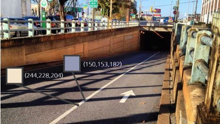
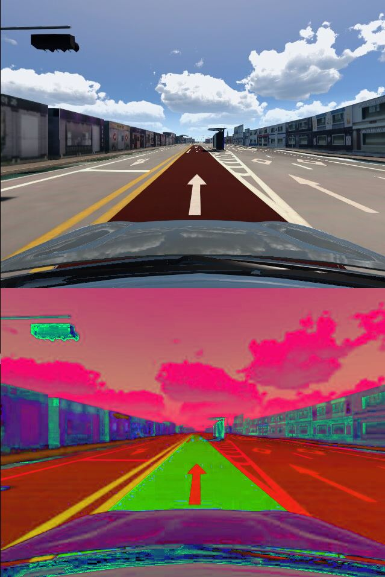
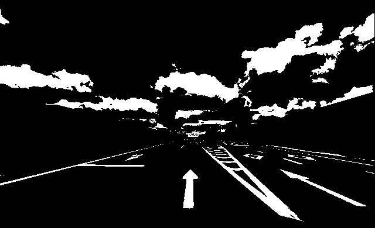
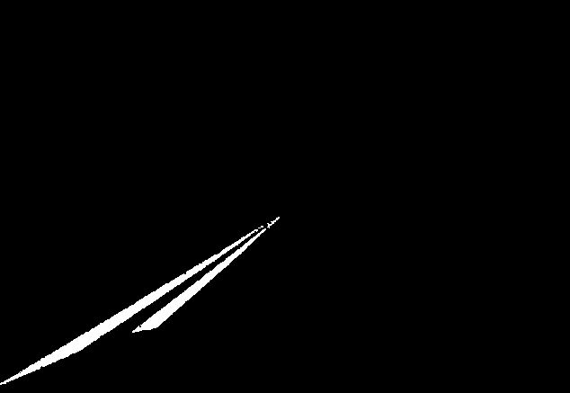
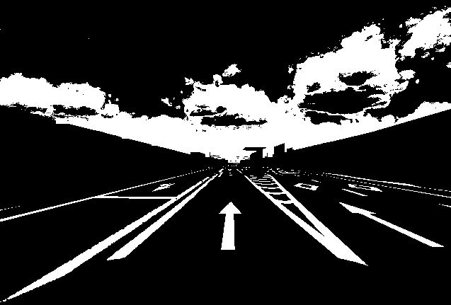
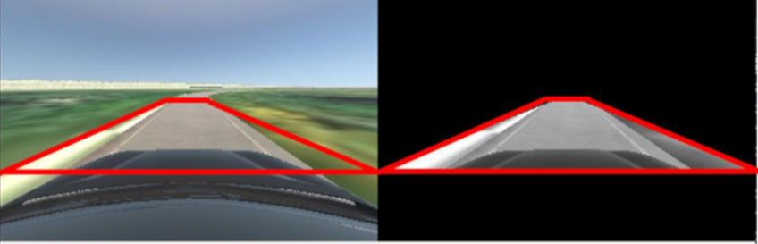
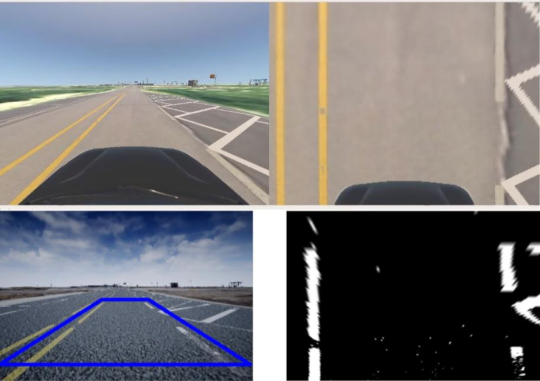

# Morai-autonomous-simulator 프로젝트 정리

1. 자율주행 차량시뮬레이션 MORAI를 사용하여 프로젝트를 진행
2. 센서(GPS, LIDAR , LADER 등을 사용)
3. ROS 통신을 사용하여 시뮬레이터와 우분투간 통신

> 시뮬레이터(MORAI) 특징 정리

- 실제와 유사하게 구현된 map 과 차량을 이용가능
- 센서 camera, LiDar, lader, IMU(가속도 센서) , GPS 사용
- 센서의 데이터를 json 형식으로 우분투와 통신
- 차량의 충돌여부, 신호등 데이터 추출

> 통신 정리

- 통신의 경우 ROS의 ROS Bridge를 사용하여 통신가능
- 통신을 위해 터미널을 여는 경우 아래 코드를 입력(단 편의를 위해 bashrc(리눅스 쉘)을 이용하여 sds , rpp 만입력하면 아래 환경 변수와 패키지 재구축이 실행됨)
```py
# catkin 환경 변수 선언
$ source ~/catkin_ws/devel/setup.bash
#패키지 재구축 
$ rospack profile
```
- ROS Bridge 를 사용하여 MORAI 와 우분투간 json형식으로 데이터 통신을 함.
- 통신을 위해서는 우분투의 ipv4 주소값을 확인하여 연동을 해줘야 한다.

> publisher listener 
- ROS를 이용하여 json형식으로 주고 받을 때 (전송자)Publisher (수신자)subscriber를 사용한다.

> 센서정리

- 라이다:
  - 원통좌표계를 사용
- 레이더
- 카메라

## 자율주행 알고리즘

자율주행 프로세스는 다음과 같다.

1. MORAI시뮬레터의 노드와 링크 데이터를 txt로 받아온다.
2. 받아온 데이터를 바탕으로 ROS의 3D 시각툴 Rviz를 사용하여 표현한다.
3. 다익스트라 알고리즘을 이용, 목적지와 자신과 가장 빠른 거리를 표시한다.
4. 표시된 경로를 따라 주행한다.

> 주행 알고리즘 

- Pure pursuit
- PID
- LFD(Look Forward Distance) 전방 주시 거리


# OpenCV를 이용한 영상 처리

> OpenCv란?

인텔에서 만든 영상처리에 특화된 오픈소스 라이브러이다. C++, Python 다양한 언어를 지원하며 영상처리, 3D 구성, 추적, 인식 , 딥러닝 까지 유용하고 강력한한 기능이 다양하게 탑재되어 있다. 

## 차선 인식 <hr>

차선인식을 하는 경우 총 4단계를 거친다.

1. 이진화
2. RoI(Region of interest)
3. Bird's eye View

> 1. 이진화

값을 1또는 0으로 변환 하는 작업. 영상의 경우 흑, 백값으로의 변환을 말한다. 이를 위해서 BGR HSV 개념을 이해해야 한다.

- RGB, HSV 개념

||RGB(OpenCv는 BGR)|HSV|
|---|---|---|
|색상|Red,Green,Blue|H색조,S채도,V명도|
|특징|우리 눈에 가장 익숙한 영상|H:빨,노,초/S:클수록 원색에 가깝/V: 255=흰,0=검| 

왜 차선인식에는 HSV를 사용하는 가? <br>
-> 날씨 또는 환경이 변화함에 따라 그림자또는 색상의 변화가 생긴다. 이때 RGB를 이용하는 경우 차선을 인식하기 위해서는 범위를 HSV보다 넓게 잡아야 하고 그 범위에 차선 뿐 아니라 다른 불필요한 요소를 포함 하는 경우가 많다. 하지만 HSV를 사용하면 이를 어느정도 보완 가능하다.

<br>

<br>
(차선 색상이 비슷해 보이지만 실제로는 많이 다르다.)

<br>
<br>

> 시뮬레이터 적용

- Opencv를 이용아여 아래와 같이 부착된 카메라를 통해 도로 BGR영상을 받은 후  
HSV 영상으로 변환 (위: BGR , 아래: HSV)
```py
img_bgr = cv2.imdecode(np_arr, cv2.IMREAD_COLOR) #BRG이미 자체
img_hsv = cv2.cvtColor(img_bgr,cv2.COLOR_BGR2HSV)  #BRG이미지를 HSV 변환
```


```py
# 최대 최소 범위를 정하여 white만 검출
lower_wlane = np.array([ 180 , 200 , 200 ])
upper_wlane = np.array([ 255 , 255 , 255 ])
```



```py
# 최대 최소 범위를 정하여 yellow만 검출
lower_ylane = np.array([  17, 100, 100 ])
upper_ylane = np.array([  22, 255, 255 ])
```



```py
# white, yellow 이미지를 결합
img_lane = cv2.bitwise_or( img_wlane, img_ylane)
```



> RoI(Region of interest)

범위를 선택하여 필요없는 부분을 제거한다.

```py 
self.crop_pts = ([0,0],[320,0],[0,240],[320,240])
```


> Bird's eye View

시점의 각도를 정면을 바라보는 것이 아닌 마치 새가 아래서 내려다 보는 것과 같이 위에서 차량을 보는 각도로 변경


