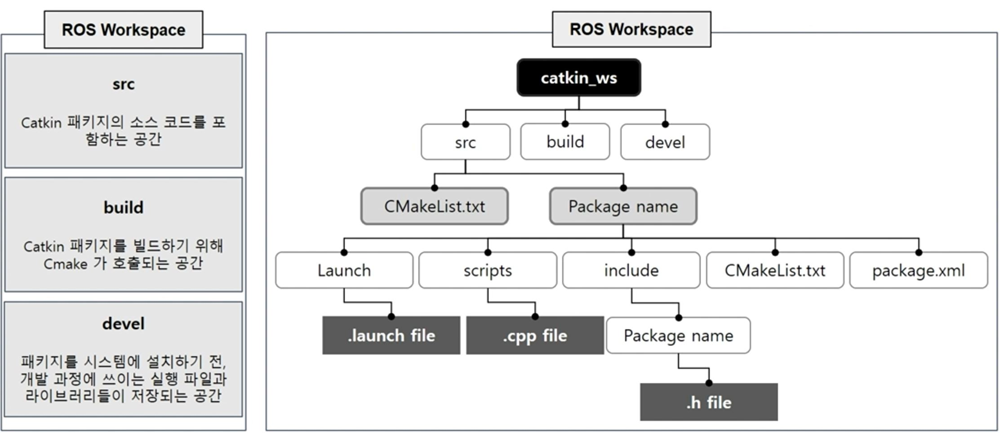

# ROS 정리
 ROS란 Robot Operating Systemd의 약어로 로봇을 개발하는데 있어 필수적인 라이브러리를 제공, 적을 때도 약어기 때문에 ROS 모두 대문자로 기입을 한다.또한 application 부분만 개발하면 되기 때문에 시간 비용 절약 효과가 있다.

<br>

> 통신 기본 개념
- ROS에서 크게 사용되는 메세지 전송 2가지 방식 차이점


|Topic|Service|
|---|---|
|단방향, 비동기 통신|양방향, 동기 통신|
|Publisher: Message 송신|Service Client: service 요청|
|Subscriber: Message 수신|Service Server: Service 응답|
|지속적으로 발생하는 송 수신에 적합|클라이언트 요청 후 서버에서 응답|
|1:N, 1:1, N:1 , N:N 모두 통신 가능| 요청과 응답이 끊기면 노드 종류|

> 


<br>

> 명령어

|명령어|용도|예시|
|---|---|---|
|roscd|리눅스의 cd 와 같은 역할로 디렉토리 변경시 사용|roscd beginner_tutorials/scripts|
|rosrun|프로그램 실행시 사용||
|rostopic|토픽에 게시되고 있는 데이터를 보여준다. |rostopic echo [topic_name]]|

> vi bachrc.

 ROS 를 사용하다 보면 프로그램 실행전 실행 시켜줘야하는 파일들이 많이 있다. 이를 매번치는 것을 번거롭기 때문에 쉘프로그램을 이용해서 간단한 명령어로 바꿔준다. 
- source 를 치면 경로를 설정
```
source /opt/ros/melodic/setup.bash
```
- sds를 입력하면 source ~/catkin_ws/devel/setup.bash 가 입력된다. rpp도 마찬가지
```
alias sds='source ~/catkin_ws/devel/setup.bash'
alias rpp='rospack profile'
```